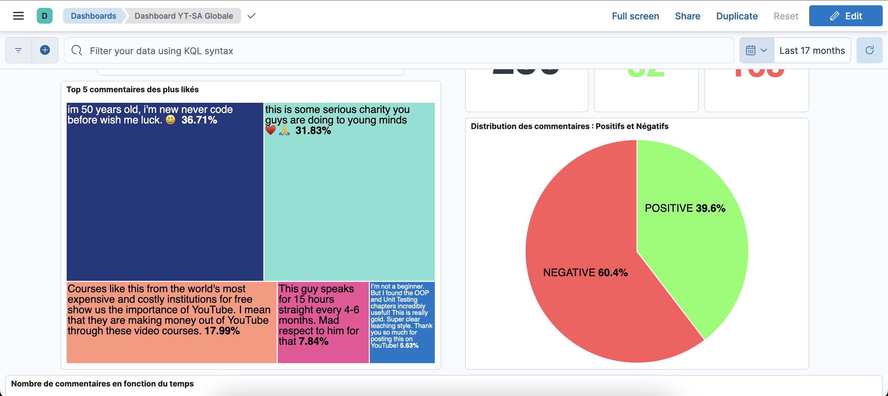
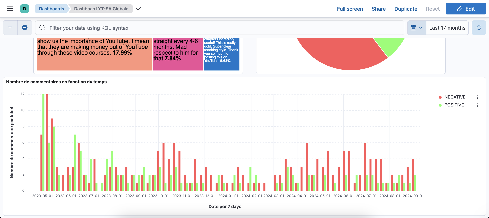
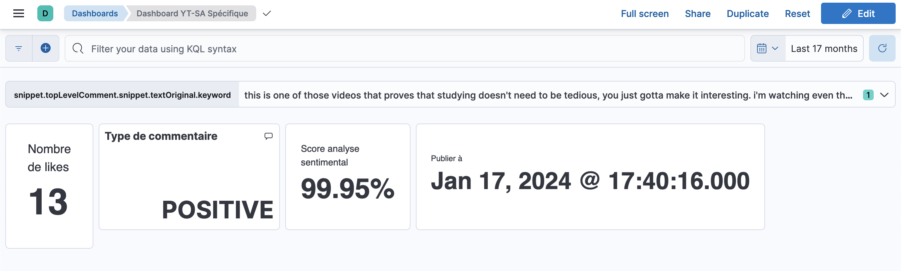

# Overview

This program allows you to retrieve comments from a chosen YouTube video. It then performs sentiment analysis using a pre-trained model from the Transformers library. The data in JSON format is then sent to a MongoDB database on Elasticsearch.

I have included some dashboard examples created with Kibana.

# Before Running the Program

Before running the YouTube comment sentiment analysis program, make sure to update the following variables in the `main.py` file:

- `password` = Your Elasticsearch user password (by default, the user 'elastic' is selected)
- `index_name` = The name of the index in your Elasticsearch database

- `videoId` = This corresponds to the identifier of a YouTube video. It can be found at the end of the URL of your YouTube video.
  Example: https://www.youtube.com/watch?v=nLRL_NcnK-4

- `api_key` = Google API key
  [How to get the API key](https://support.google.com/googleapi/answer/6158862?hl=en)

# Usage

```python
python3 main.py
```

# DashBoards






